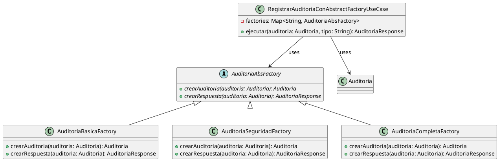

# Contexto del Patrón Abstract Factory - Servicio de Auditoría

## 1. Introducción

Este documento describe la implementación del **Patrón Abstract Factory** (Gang of Four) en el servicio de auditoría del proyecto. El patrón se aplicó para crear familias de objetos relacionados (auditías de diferentes tipos) sin especificar sus clases concretas.

---

## 2. Estructura del Patrón

El Patrón Abstract Factory proporciona una interfaz para crear **familias de objetos relacionados** sin especificar sus clases concretas.

```
┌─────────────────────────────────────────────────────────────────┐
│                PATRÓN ABSTRACT FACTORY                          │
│                  Servicio de Auditoría                          │
├─────────────────────────────────────────────────────────────────┤
│                                                                 │
│  ┌─────────────────────────────────────────────────────────┐  │
│  │              AuditoriaAbsFactory                         │  │
│  │              (Abstract Factory)                         │  │
│  │  + crearAuditoria()                                    │  │
│  │  + crearRespuesta()                                    │  │
│  └─────────────────────────────────┬───────────────────────┘  │
│                                    │                             │
│                    ┌───────────────┼───────────────┐           │
│                    │               │               │           │
│                    ▼               ▼               ▼           │
│  ┌─────────────────────┐ ┌─────────────────────┐ ┌─────────────────────┐  │
│  │AuditoriaBasicaFactory│ │AuditoriaSeguridadFactory│ │AuditoriaCompletaFactory│  │
│  │(Concrete Factory)   │ │(Concrete Factory)    │ │(Concrete Factory)   │  │
│  └─────────────────────┘ └─────────────────────┘ └─────────────────────┘  │
│                                                                 │
└─────────────────────────────────────────────────────────────────┘
```

---

## 3. Clases Implementadas

### 3.1 AuditoriaAbsFactory (Abstract Factory)

**Ubicación**: `Domain/AbsFactory/AuditoriaAbsFactory.java`

**¿Qué es?**: Es la clase abstracta que define la interfaz para crear los diferentes tipos de auditorías.

**¿Por qué se creó?**: Para establecer el contrato base que todas las factories concretas deben seguir, permitiendo crear familias de productos relacionados.

```java
package com.gobierno.servicio_auditoria.Domain.AbsFactory;

import com.gobierno.servicio_auditoria.Domain.Model.Auditoria;
import com.gobierno.servicio_auditoria.Infrastructure.DTO.AuditoriaResponse;

public abstract class AuditoriaAbsFactory {

    public abstract Auditoria crearAuditoria(Auditoria auditoria);

    public abstract AuditoriaResponse crearRespuesta(Auditoria auditoria);
    
}
```

**Responsabilidades**:
- Define los métodos abstractos para crear auditorías
- Define los métodos abstractos para crear respuestas
- Actúa como interfaz común para todas las factories concretas

---

### 3.2 AuditoriaBasicaFactory (Concrete Factory)

**Ubicación**: `Domain/FactoryConcret/AuditoriaBasicaFactory.java`

**¿Qué es?**: Es una implementación concreta de `AuditoriaAbsFactory` que crea específicamente auditorías de tipo BÁSICA.

**¿Por qué se creó?**: Para encapsular toda la lógica de creación de auditorías básicas, incluyendo el tipo y los campos de la respuesta.

```java
package com.gobierno.servicio_auditoria.Domain.FactoryConcret;

import com.gobierno.servicio_auditoria.Domain.AbsFactory.AuditoriaAbsFactory;
import com.gobierno.servicio_auditoria.Domain.Model.Auditoria;
import com.gobierno.servicio_auditoria.Infrastructure.DTO.AuditoriaResponse;

public class AuditoriaBasicaFactory extends AuditoriaAbsFactory {

    @Override
    public Auditoria crearAuditoria(Auditoria auditoria) {
        auditoria.setTipo("BASICA");
        return auditoria;
    }

    @Override
    public AuditoriaResponse crearRespuesta(Auditoria auditoria) {
        return new AuditoriaResponse.Builder()
                .usuario(auditoria.getUsuario_id())
                .accion(auditoria.getAccion())
                .descripcion(auditoria.getDescripcion())
                .tipo(auditoria.getTipo())
                .build();
    }

}
```

**Responsabilidades**:
- Define el tipo como "BASICA"
- Crea respuesta con campos: usuario, accion, descripcion, tipo

---

### 3.3 AuditoriaSeguridadFactory (Concrete Factory)

**Ubicación**: `Domain/FactoryConcret/AuditoriaSeguridadFactory.java`

**¿Qué es?**: Es una implementación concreta de `AuditoriaAbsFactory` que crea específicamente auditorías de tipo SEGURIDAD.

**¿Por qué se creó?**: Para manejar auditorías de seguridad que requieren incluir la dirección IP de origen.

```java
package com.gobierno.servicio_auditoria.Domain.FactoryConcret;

import com.gobierno.servicio_auditoria.Domain.AbsFactory.AuditoriaAbsFactory;
import com.gobierno.servicio_auditoria.Domain.Model.Auditoria;
import com.gobierno.servicio_auditoria.Infrastructure.DTO.AuditoriaResponse;

public class AuditoriaSeguridadFactory extends AuditoriaAbsFactory {

    @Override
    public Auditoria crearAuditoria(Auditoria auditoria) {
        auditoria.setTipo("SEGURIDAD");
        return auditoria;
    }

    @Override
    public AuditoriaResponse crearRespuesta(Auditoria auditoria) {
        return new AuditoriaResponse.Builder()
                .usuario(auditoria.getUsuario_id())
                .accion(auditoria.getAccion())
                .descripcion(auditoria.getDescripcion())
                .ip(auditoria.getIp_origen())
                .tipo(auditoria.getTipo())
                .build();
    }

}
```

**Responsabilidades**:
- Define el tipo como "SEGURIDAD"
- Crea respuesta con campos adicionales: ip_origen

---

### 3.4 AuditoriaCompletaFactory (Concrete Factory)

**Ubicación**: `Domain/FactoryConcret/AuditoriaCompletaFactory.java`

**¿Qué es?**: Es la implementación más completa de `AuditoriaAbsFactory`, que crea auditorías con todos los campos disponibles incluyendo timestamp.

**¿Por qué se creó?**: Para manejar auditorías completas que requieren timestamp automático y retornan todos los campos.

```java
package com.gobierno.servicio_auditoria.Domain.FactoryConcret;

import java.sql.Timestamp;

import com.gobierno.servicio_auditoria.Domain.AbsFactory.AuditoriaAbsFactory;
import com.gobierno.servicio_auditoria.Domain.Model.Auditoria;
import com.gobierno.servicio_auditoria.Infrastructure.DTO.AuditoriaResponse;

public class AuditoriaCompletaFactory extends AuditoriaAbsFactory {

    @Override
    public Auditoria crearAuditoria(Auditoria auditoria) {
        auditoria.setTipo("COMPLETA");
        auditoria.setFecha(new Timestamp((System.currentTimeMillis())));
        return auditoria;
    }

    @Override
    public AuditoriaResponse crearRespuesta(Auditoria auditoria) {
        return new AuditoriaResponse.Builder()
                .usuario(auditoria.getUsuario_id())
                .accion(auditoria.getAccion())
                .descripcion(auditoria.getDescripcion())
                .ip(auditoria.getIp_origen())
                .fecha(auditoria.getFecha())
                .tipo(auditoria.getTipo())
                .build();
    }

}
```

**Responsabilidades**:
- Define el tipo como "COMPLETA"
- Agrega timestamp automáticamente
- Crea respuesta con todos los campos disponibles

---

### 3.5 RegistrarAuditoriaConAbstractFactoryUseCase (Client)

**Ubicación**: `Application/UseCase/RegistrarAuditoriaConAbstractFactoryUseCase.java`

**¿Qué es?**: Es el caso de uso que actúa como cliente del patrón Abstract Factory. Selecciona y utiliza las factories concretas.

**¿Por qué se creó?**: Para demostrar y utilizar el patrón Abstract Factory en el registro de auditorías, seleccionando la factory apropiada según el tipo.

```java
package com.gobierno.servicio_auditoria.Application.UseCase;

import java.util.HashMap;
import java.util.Map;

import org.springframework.stereotype.Service;

import com.gobierno.servicio_auditoria.Domain.AbsFactory.AuditoriaAbsFactory;
import com.gobierno.servicio_auditoria.Domain.FactoryConcret.AuditoriaBasicaFactory;
import com.gobierno.servicio_auditoria.Domain.FactoryConcret.AuditoriaCompletaFactory;
import com.gobierno.servicio_auditoria.Domain.FactoryConcret.AuditoriaSeguridadFactory;
import com.gobierno.servicio_auditoria.Domain.Model.Auditoria;
import com.gobierno.servicio_auditoria.Domain.Prototype.AuditoriaPrototypeRegistry;
import com.gobierno.servicio_auditoria.Infrastructure.DTO.AuditoriaResponse;
import com.gobierno.servicio_auditoria.Ports.Output.RegistroAuditoria;

@Service
public class RegistrarAuditoriaConAbstractFactoryUseCase {

    private final RegistroAuditoria registroAuditoria;
    private final Map<String, AuditoriaAbsFactory> factories;

    public RegistrarAuditoriaConAbstractFactoryUseCase() {
        this.registroAuditoria = null;
        this.factories = new HashMap<>();
        factories.put("BASICA", new AuditoriaBasicaFactory());
        factories.put("SEGURIDAD", new AuditoriaSeguridadFactory());
        factories.put("COMPLETA", new AuditoriaCompletaFactory());
    }

    public AuditoriaResponse ejecutar(Auditoria auditoria, String tipo) {

        Auditoria auditoriaBase = AuditoriaPrototypeRegistry.obtenerPrototipo(tipo);

        auditoriaBase.setUsuario_id(auditoria.getUsuario_id());
        auditoriaBase.setAccion(auditoria.getAccion());
        auditoriaBase.setDescripcion(auditoria.getDescripcion());
        auditoriaBase.setIp_origen(auditoria.getIp_origen());

        AuditoriaAbsFactory factory = factories.get(tipo.toUpperCase());

        if (factory == null) {
            throw new IllegalArgumentException("Tipo de auditoria invalido");
        }

        Auditoria auditoriaProcesada = factory.crearAuditoria(auditoriaBase);

        return factory.crearRespuesta(auditoriaProcesada);
    }
}
```

**Responsabilidades**:
- Mantiene un mapa de factories
- Selecciona la factory correcta según el tipo
- Delega la creación a la factory seleccionada
- Utiliza el patrón Prototype para obtener plantillas base

---

## 4. Flujo de Ejecución

```
┌─────────────────────────────────────────────────────────────────┐
│                    FLUJO DE EJECUCIÓN                           │
│                 (Abstract Factory)                               │
└─────────────────────────────────────────────────────────────────┘

1. Cliente (Controller/UseCase)
   │
   ▼ Solicitar auditoría tipo "BASICA"
   │
2. Factory selector = factories.get("BASICA")
   │
3. AuditoriaAbsFactory factory
   │
4. factory.crearAuditoria(auditoriaBase)
   │       └── AuditoriaBasicaFactory.setTipo("BASICA")
   │
5. factory.crearRespuesta(auditoria)
   │       └── return AuditoriaResponse{usuario, accion, descripcion, tipo}
   │
6. Response al cliente
```

---

## 5. Beneficios del Patrón Abstract Factory

| Beneficio | Descripción |
|-----------|-------------|
| **Aislamiento de código** | Las clases concretas están ocultas en las factories |
| **Intercambiabilidad** | Se puede cambiar de familia de factories sin cambiar el código cliente |
| **Consistencia** | Garantiza que los productos de una familia se usen juntos |
| **Fácil extensibilidad** | Añadir nuevas factories concretas sin modificar el cliente |

---

## 6. Comparación con Bridge

| Aspecto | Abstract Factory | Bridge |
|---------|----------------|--------|
| **Propósito** | Crear familias de objetos | Separar abstracción de implementación |
| **Estructura** | Jerarquía de factories | Dos jerarquías paralelas |
| **Crea** | Objetos relacionados | Procesamiento + implementación |
| **Flexibilidad** | Cambio de familia | Cambio de implementación |
| **Cliente** | Selecciona factory | Delega a processor |

---

## 7. Diagrama UML (PlantUML)



---

## 8. Estructura de Archivos

```
servicio_auditoria/
├── Domain/
│   ├── AbsFactory/                              ← PATRÓN ABSTRACT FACTORY
│   │   └── AuditoriaAbsFactory.java            ← Abstract Factory
│   ├── FactoryConcret/                          ← Concrete Factories
│   │   ├── AuditoriaBasicaFactory.java
│   │   ├── AuditoriaSeguridadFactory.java
│   │   └── AuditoriaCompletaFactory.java
│   └── Bridge/                                 ← PATRÓN BRIDGE (separado)
│       ├── Abstraction/
│       │   ├── AuditoriaProcessor.java
│       │   └── RegistrarAuditoriaProcessor.java
│       └── Implementor/
│           ├── AuditoriaCreator.java
│           ├── BasicaAuditoriaCreator.java
│           ├── SeguridadAuditoriaCreator.java
│           └── CompletaAuditoriaCreator.java
└── Application/
    └── UseCase/
        ├── RegistrarAuditoriaUseCase.java              ← Usa Bridge
        └── RegistrarAuditoriaConAbstractFactoryUseCase.java  ← Usa Abstract Factory
```

---

## 9. Cuándo Usar Cada Patrón

### Abstract Factory (Este archivo)
- ✅ Cuando necesitas crear familias de objetos relacionados
- ✅ Cuando quieres ocultar las clases concretas al cliente
- ✅ Cuando necesitas garantizar consistencia entre productos

### Bridge (Ver ContextoBridge.md)
- ✅ Cuando quieres separar la abstracción de la implementación
- ✅ Cuando ambas jerarquías pueden variar independientemente
- ✅ Cuando necesitas cambiar implementaciones en runtime

---

## 10. Autor y Fecha

- **Autor**: Equipo de Desarrollo
- **Fecha de Implementación**: Abril 2026
- **Versión**: 1.0

---

## 11. Referencias

- **GoF (Gang of Four)**: Design Patterns: Elements of Reusable Object-Oriented Software (1994)
- **Patrón Abstract Factory**: Provide an interface for creating families of related objects
